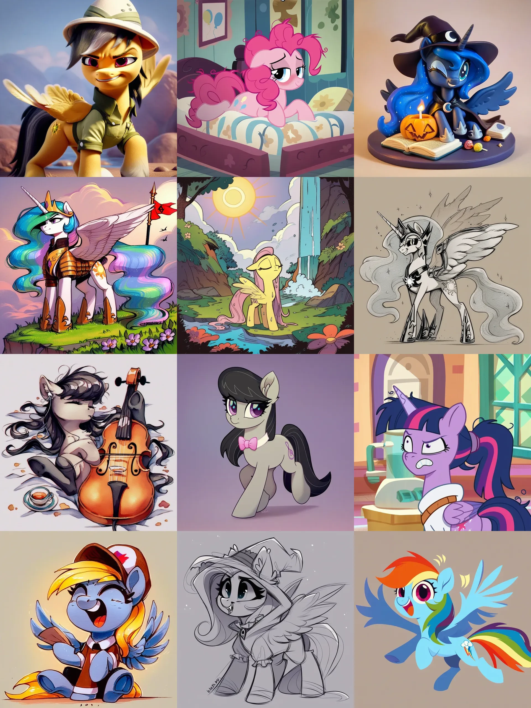
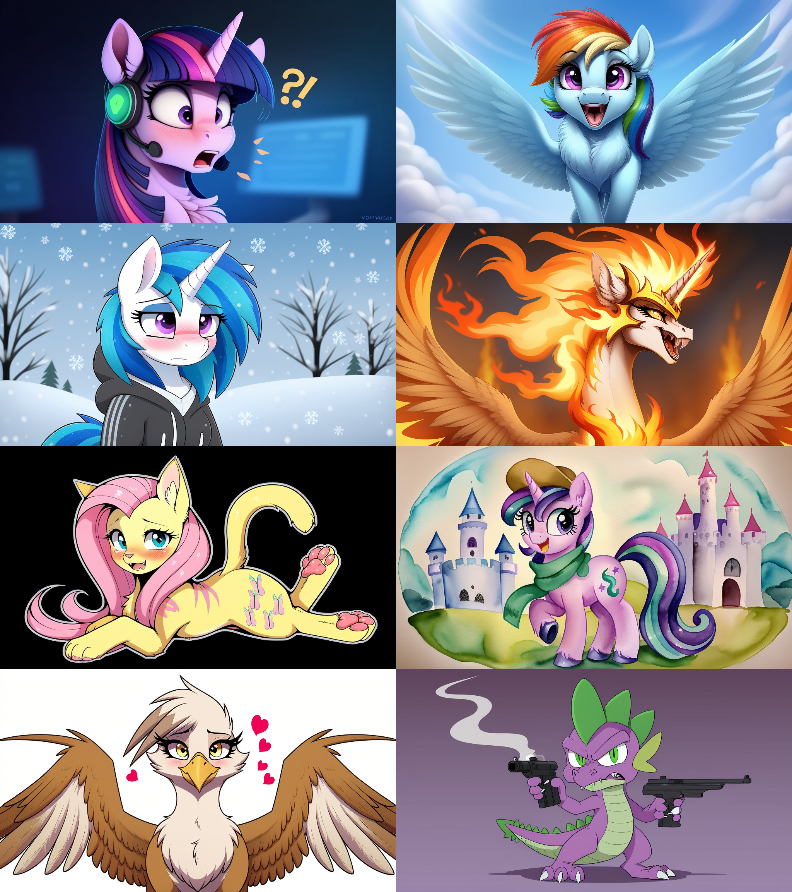
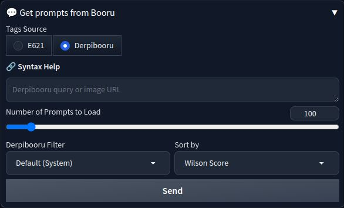
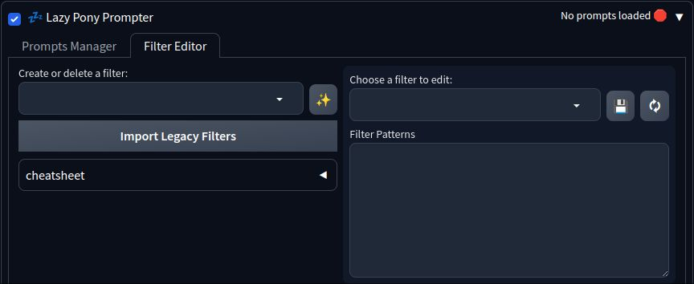
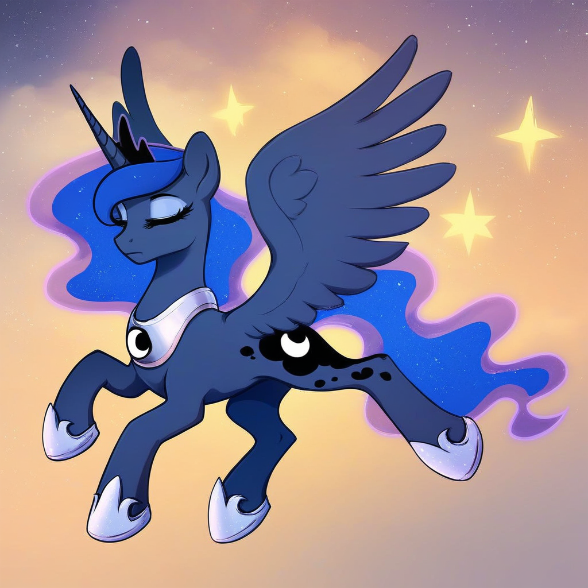

# Lazy Pony Prompter

A booru API powered prompt generator for [AUTOMATIC1111's Stable Diffusion Web UI](https://github.com/AUTOMATIC1111/stable-diffusion-webui) and [ComfyUI](https://github.com/comfyanonymous/ComfyUI) with flexible tag filtering system and customizable prompt templates.

Supported boorus/websites:
* [Derpibooru](https://derpibooru.org)
* [E621](https://e621.net)
* More coming soon™

> [!IMPORTANT]
> **1.0.0 release highlights:**
> * Overhauled UI
> * New tag filtering system with filter management and pattern substitutions
> * Filter prompts by content rating (Safe/Questionable/Explicit)
> * Increased maximum prompts fetching limit to 1500
> * Improved status reporting and logging
> * See [Filter Editor](#filter-editor) for converting legacy filter strings to new format

Derpibooru + [Pony Diffusion V6 XL](https://civitai.com/models/257749?modelVersionId=290640) + [PD Styles Collection](https://github.com/Siberpone/pd-styles) (which I highly recommend you also check out) samples:



E621 + [EasyFluff](https://civitai.com/models/129996/easyfluff) samples:



*\* images generated with EasyFluff V11.2 from query `my_little_pony solo -anthro -meme order:score -animated -text rating:safe -multiple_images`*

# Installation

### ❗Requirements
* [AUTOMATIC1111's Stable Diffusion Web UI](https://github.com/AUTOMATIC1111/stable-diffusion-webui) or [ComfyUI](https://github.com/comfyanonymous/ComfyUI);
* One of recommended models (these are the "officially" supported models, but LPP should work well for other tag-based models as long as their "native" booru is used as tag source):
  * [Pony Diffusion V6 XL](https://civitai.com/models/257749?modelVersionId=290640);
  * [EasyFluff](https://civitai.com/models/129996/easyfluff);
  * [Pony Diffusion V5(.5)](https://civitai.com/models/95367/pony-diffusion-v5);
* Active internet connection for communication with boorus;
* *(optional)* [Derpibooru](https://derpibooru.org) account for extra functionality.

### 🖵  A1111 WebUI

Open the "Extensions" tab and then the "Install from URL" tab. Paste this repository link into the "URL" field:
```
https://github.com/Siberpone/lazy-pony-prompter
```

Click "Install" and after it's finished installing, restart the server. You should  now see the "Lazy Pony Prompter" accordion on txt2img tab.

### 🛏 ComfyUI

Clone this repository to `.../ComfyUI/custom_nodes`

### 🙌 Manual
Clone this repository with:
```
git clone https://github.com/Siberpone/lazy-pony-prompter
```
Or click the "code" button in the top right, then click "Download ZIP". Unzip the downloaded archive anywhere on your file system. After that move the newly created repository folder to `.../stable-diffusion-webui/extentions` for A1111 WebUI or to `.../ComfyUI/custom_nodes` for ComfyUI.

# Usage
LPP operates by making a prompt list from a search query to one of the supported booru sites and then generating images using that list. Basically, it fetches tag data from a specified number of images in the query and converts it into "sensible" model-specific prompts (useless meta tags are pruned; "important" tags, like character name, are pushed closer to the beginning of the prompt, and so on...) and then randomly picks them to generate images.

## A1111 WebUI

### Prompts Manager
Now, lets take a closer look at the interface:


Firstly, note the title bar of the extension: `🗹`checkbox on the left side is the main toggle for LPP - it controls whether the extension is active or not; and on the right side you'll find the status indicator that shows some basic information about the currently loaded prompts collection.

Next, we move down to the "Prompts Manager" tab where you'll find the main controls for LPP:
* **Prompts Collection Name** is used for selecting existing prompt collections or for saving currently loaded ones. Note the four buttons to the right:
  * 📋 toggles the selected collection extra info display underneath the `Prompts Collection Name`;
  * 💾 saves the currently loaded collection under the name provided in the `Prompts Collection Name`;
  * 📤 loads the collection selected in the `Prompts Collection Name`;
  * ❌ deletes the collection selected in the `Prompts Collection Name`.
* **Prompts Format** is used to select model-specific prompt formatting. Normally, you don't need to worry about it and can just keep in on `Auto` at all times.
* **Autoload Filters** indicates whether the `Filters` input should automatically be populated when loading a prompt collection (whenever you save a prompt collection, the information about currently active filters is written along with it).

#### 💬 Get prompts from Booru

> [!NOTE]
>
> Look of this panel may vary slightly, depending on the selected tag source.



On this panel you can pull tag data from selected booru site by typing in or pasting your query into the query textbox (the syntax is exactly the same as on the actual website). Use the `Tag Source` toggle at the top to select the desired booru. If you just want tags from a particular image, you can paste its URL into the query textbox or simply type in its ID number on the respective booru. You can also set a number of additional options:

* **Number of prompts to load** - will attempt to fetch tag data from this number of images in the query;
* **Derpibooru specific:**
  * *Derpibooru Filter* - will apply this [Derpibooru filter](https://derpibooru.org/filters) to the query. Only system filters are available by default. If you want to use your personal filters, you must provide an [API key](#-api-key);
  * *Sort by* - type of sorting to apply to the query. Wilson Score is the default.
* **E621 specific:**
  * *Rating* - will append selected rating tag to the query.
  * *Sort by* - will append selected sorting type tag to the query.

Once you're happy with the settings, it's finally time to click the `Send` button. This will prompt LPP to send the search query to the site and generate prompts from the returned tag data. If all goes well, you'll see the "Successfully fetched tags from *\<site\>*" message pop up. This means that LPP is now ready to poni and all you have to do is tick the `☑` checkbox at the very top and hit the `Generate` button.

#### 🏷 Filtering System

On the right side of the "Prompts Manager" panel you'll find the tags and prompts filtering controls that will help you customize and refine the composition of LPP-generated prompts. The filtering system allows you to filter out unwanted tags or substitute them with custom text. You can specify patterns that you wish to filter out or substitute in two ways:

1. by creating a filter in the [Filter Editor](#filter-editor) and selecting it in the `Filters` input;
2. by typing comma-separated patterns into the `Quick Filter` input.

Note that pattern syntax supports simple [globbing](https://en.wikipedia.org/wiki/Glob_(programming)) and optional substitutions:

* `*` matches anything;
* `?` matches any single character;
* `[xyz]` matches specified characters;
* `[A-Z]` matches a range of characters;
* `||` is used to provide a substitution for a pattern. For example, `horn||wings` will substitute "horn" with "wings".

> [!TIP]
> Use `Quick Filter` only for on-the-spot one-shot filtering needs. If you find yourself typing in the same things into it over and over, consider creating a persistent filter in the Filter Editor - it'll save you a lot of time! Over time you'll build up your "filter library" and if you put a bit of effort into maintaining and expanding it, soon you'll be able to generate prompts with great flexibility and variety.

And last but not least for the filtering system is the `Rating Filter`. It allows LPP to only sample prompts with selected content ratings from currently loaded prompts. The ratings are determined from the meta data returned by the boorus.

> [!WARNING]
> If the currently loaded collection doesn't have any prompts with selected ratings, the generation will fail. Use the 📋 extra info panel to see what kind of ratings any given prompt collection contains.

### Filter Editor



This tab is used to manage and edit your persistent filters that can then be applied to LPP-generated prompts via selecting them in the `Filters` input on the "Prompts Manager" tab. On the left you'll find the `Create or delete a filter` input that is used to manage your filters: type in a new name for a filter and click the ✨ to create a new filter or select an existing filter form a drop-down list and click the ❌ to delete it. The `Import Legacy Filters` button underneath is used to convert your pre-1.0.0 saved filter strings to the new system. It will create a new persistent filter for each prompt collection that has legacy filter string attached to it and automatically add it to the collection's autoload list. You only need to run this once.

Next you'll find a number of identical filter editors that are used to edit the filters. You can adjust the number of editors in the LPP's section of A1111 settings. To load up a filter, simply choose it from a drop-down in any of the editors (hit the 🗘 button if the desired filter doesn't appear on the list) and start editing the filter patterns. The syntax is exactly the same as described in the [Filtering System](#-filtering-system), but patterns are separated with new lines. Click the 💾 button to save changes to the filter.

> [!TIP]
> Changes to the filters are applied "on the fly". So, if you have a filter activated in the "Prompts Manager" and you add changes to it in the editor, the changes will apply on next generation

#### Examples

**Rule 63**
```
mare||stallion
female||male
male||female
stallion||mare
```

**Style Altering Tags**
```
anime
grayscale
monochrome
black and white
show accurate*
vector
sketch
traditional art
* drawing
* painting
pixelated
pixel art
3d
source filmmaker
etc...
```

**Text**
```
holding sign
dialogue
speech bubble
```


### ✨ Prompts Styling

> [!TIP]
> Check out my [PD Styles Collection](https://github.com/Siberpone/pd-styles). It works great in conjunction with LPP!

You can customize LPP-generated prompts by placing special tokens into the standard A1111 prompt textbox. When LPP is enabled, it basically serves as a template. LPP groups tags into certain categories which can then be referenced through tokens. LPP currently recognizes 7 tokens: `{character}`, `{species}`, `{rating}`, `{artist}`, `{general}`, `{meta}` and `{prompt}`. Lets take a look at some examples:

* *V6 XL prompt with special quality tags*: `score_9, score_8_up, score_7_up, score_6_up, score_5_up, score_4_up, {prompt}`
* *"fancy" V6 XL prompt:* `score_9, score_8_up, score_7_up, score_6_up, score_5_up, score_4_up, {rating}, a beautiful digital drawing of a {character} in the form of {species}, {general}`
* *EasyFluff*: `{character}, {species}, {artist}, {general}, {meta}, masterpiece, best quality, good quality`

When no template is provided, a sensible default one will be used. If user template doesn't contain any special tokens, its content will simply be appended to the default template. Note that `{prompt}` token is special and it should not be used in conjunction with other tokens. If it is present in the user template, the default template will be pasted in its place, and all other tokens will be pruned.

> [!NOTE]
> Don't worry about the cases when some tokens may end up empty (a poorly tagged image, for example). LPP will properly clean up multiple/leading/trailing spaces and commas.

LPP also fully supports [A1111 styles feature](https://github.com/AUTOMATIC1111/stable-diffusion-webui/wiki/Features#styles). Any styles you select in the style box will be correctly applied to LPP-generated prompts.

#### Pony Diffusion V6 XL Recommendations

Both e621 and Derpibooru work fine as tag sources, but Derpi is preferred. As usual with Pony Diffusion models, preface your prompts with special quality tags: `score_9, score_8_up, score_7_up, score_6_up, score_5_up, score_4_up` (yes, it has to be exactly like this due to mistake in training process). `blurry` in the negative is highly recommended to avoid random "depth of field" spots.

#### EasyFluff Recommendations

EF works best with e621 as tags source, but will produce good results from Derpibooru tags as well.

#### Pony Diffusion V5 Recommendations

Derpibooru as tags source is highly recommended, however, e621 is also supported. It is also highly beneficial to, at least, include special model-specific `score_9` tag somewhere in the prompt. "Standard" negative prompt also improves generations quality: `lowres, bad anatomy, bad hands, text, error, missing fingers, extra digit, fewer digits, cropped, worst quality, low quality, jpeg artifacts, signature, watermark, username, blurry`.

## ComfyUI

> [!NOTE]
>
> These are somewhat experimental and may have some bugs. Also, due to some ComfyUI interface limitations some UX compromises had to be made ;)

LPP nodes are available under `LPP` group. The interface and functionality are kept as closely as possible to A1111 extension. Drag this Princess Luna picture to your ComfyUI to load a demo with notes on every available node and a very basic workflow example:



## 🔑 API Key

To further personalize your queries you can provide LPP with your personal Derpibooru API key (requires Derpibooru account). This will enable LPP to use your personal [Derpibooru filters](https://derpibooru.org/filters) and access images from your watch list by including `my:watched` into your queries. To provide an API key, go to `Settings -> Lazy Pony Prompter` and paste the key into the respective textbox. Then click "Apply settings" and reload UI. You can obtain an API key from your Derpibooru account info page (hover over your user icon -> Account).

# Pro Tips & Potential Pitfalls
* 🐞 Found a bug? Create an [issue](https://github.com/Siberpone/lazy-pony-prompter/issues).
* 💬 Want to request a feature or have suggestions on how to improve the extension? Open up a [discussion](https://github.com/Siberpone/lazy-pony-prompter/discussions).
* You can see the latest additions to LPP in the [Changelog](CHANGELOG.md).
* You can use A1111's "Defaults" feature to customize LPP UI default values (Settings -> Defaults).
* LPP works best with images with high upvote/score count as those tend to be the most fully and properly tagged.
* LPP overrides webui prompts processing completely and, thus, not compatible with dynamic prompting extensions (you don't have to uninstall them or anything, just don't run them simultaneously with LPP).
* LPP is very light on traffic since it uses the website's API and only pulls necessary text data and not the actual webpages or images.
* Your saved prompts are stored in `tag_cache.dat` file in the root extension directory.
* Useful links:
    * [purplesmart.ai](https://purplesmart.ai) aka PSAI - V5 creators website with gallery and prompt examples.
    * [PSAI Discord server](http://discord.gg/94KqBcE) - poni AI discussion, help, tech support and free V5 bot.
    * [EasyFluff](https://civitai.com/models/129996/easyfluff)
    * [Stable Diffusion Guides Collection](https://rentry.org/sdgoldmine)
* 🐎 Please, poni responsibly 🐴🦄🪶.
